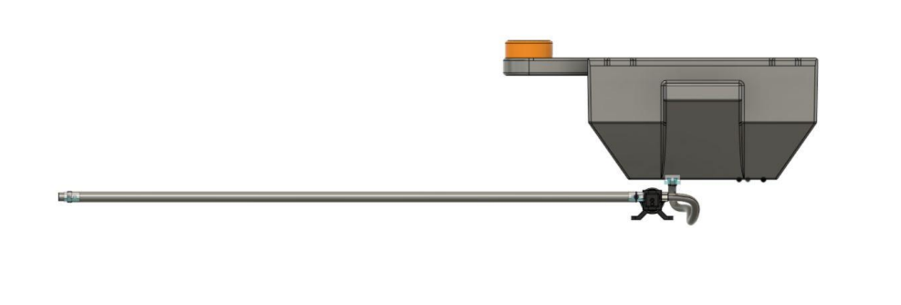
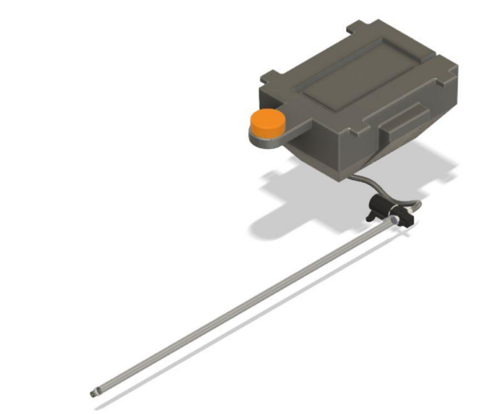
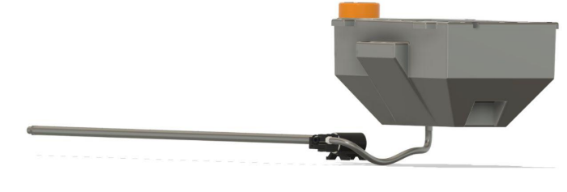

# Fire-Fighting Drone Subsystem

## Table of Contents
- [Introduction](#introduction)
- [Market Research](#market-research)
- [Conceptual Design](#conceptual-design)
- [Embodiment and Detailed Design](#embodiment-and-detailed-design)
- [Fabrication and Assembly](#fabrication-and-assembly)
- [Conclusion](#conclusion)

## Introduction

### Background and Scope of Problem
Fire departments are seeing large benefits from the use of drones during structure fires and search and rescue missions. In the case of a structure fire, when first arriving on the scene, the drone can be deployed to assess the scene, before the firefighters are put in harm's way. When equipped with a thermal camera, the drone can show operators where the hotspots are, and also have the ability to see through smoke and in low light conditions. The thermal camera can then allow operators to monitor crew members and conditions, improving efficiency and safety. The drone can also be equipped with a spotlight to assist firefighters in dark or low light conditions. After the smoke has cleared, drones can also aid in the critical work of assessing the damage, whether it be from a fire or other natural disasters. Drones allow firefighters to quickly and effectively scout out dangerous fires, observe and monitor a large blaze and the surrounding area and more.

### Design Philosophy
Our design is inspired by the term simplicity, where we have kept everything fit to our requirements, keeping the aesthetic look of the drone.

### Problem Statement
Building a subsystem for fire extinguisher drone that can control the flow rate of fire extinguishing material based on the amount of fire.

### Beneficiaries
Beneficiaries from the fire extinguishing drone are:
- Firefighters who have difficulty in entering the above floors of high-rise buildings.
- MNC’s which can use drones in case of fire emergency in high-rise buildings.

### Organization of this Report
The report is organized in such a way that it gives you a clear picture of how we will develop this subsystem.

## Market Research

### Existing Market Products
Firefighting drones have become increasingly popular in recent years due to their ability to reach inaccessible areas and quickly extinguish fires. Several types of firefighting drones are currently available on the market, each with its unique features and capabilities. The DJI Matrice 300 RTK and the DJI Mavic 2 Enterprise Dual are two popular drones designed for firefighting.

But none of the existing products have automatic controls. In our project, we will be integrating the camera with an extinguishing subsystem so that manual operation is reduced to a minimum extent. Moreover, our project design would be modular so it could be used for both tanker-based and tethered connection-based models.

### Comparison with Existing Technology
The integration of automatic controls into our project's camera and extinguishing subsystem will bring numerous benefits. It will allow for more efficient and faster response times to fires, reducing the potential for extensive damage and loss of life. The reduction in manual operation also reduces the risk to firefighters, who can be placed in dangerous situations when manually operating firefighting equipment.

### Problems with the Existing Fire Extinguisher Drones
There are several problems with existing fire extinguishing drones, including:
1. Limited capacity: Most existing fire extinguishing drones have limited capacity and can only carry a small amount of water or fire retardant. This limits their effectiveness in extinguishing large fires. Tethered connection can solve this problem.
2. Limited range: The range of existing fire extinguishing drones is limited by their battery life and communication range. This makes them less effective in extinguishing fires in remote or inaccessible areas.
3. Limited accuracy: Existing fire extinguishing drones may have limited accuracy in targeting fires, especially in windy conditions. This can lead to wasted resources and ineffective firefighting efforts. Usage of high-quality motor and other subparts can improve this to a certain extent.
4. Limited adaptability: Many existing fire extinguishing drones are designed for specific types of fires or environments, and may not be easily adaptable to different situations. Usage of the best type of extinguishing agent can help in this matter.
5. Limited autonomous capabilities: Some existing fire extinguishing drones require human operators to control them, which can limit their effectiveness and increase the risk to human operators in dangerous situations. Through our automation model, we have solved this problem in a simple way.

Addressing these challenges will be critical in developing more effective fire extinguishing drones that can improve the safety and effectiveness of firefighting operations. Through our model, we solved most of the existing problems related to firefighting drones.

## Conceptual Design

### Ideation
Initially, we decided to create a drone that has the capabilities to extinguish fires. Our goal was to maximize the range and variety of fires extinguished while using the most efficient material to do so in the process. We enlisted all types of extinguishing materials and also the types of nozzles, pipes, etc. We wrote code for the optimization function. We then decided to integrate a camera into our subsystem. After seriously considering the various agents that we can use for extinguishing fire, we find foam to be the most suitable one. Along with this, we decided to conserve the material by automating it to stop and start depending on the presence of fire. The switching mechanism was also of PWM type integrated within the pump, so it could be used later on to control the flow. We finalized on a 220 PSI, 10L/min diaphragm pump to spray out our foam and a conduit of 1.3m of PVC and also a tank of 10L capacity.

#### Types of Fires
| SL No | Element               | Density         | Types of fire | Limitations                                     | Advantages                                          |
|-------|-----------------------|-----------------|---------------|-------------------------------------------------|-----------------------------------------------------|
| 1     | Water                 | 1 kg/m³         | A             | - Add Anti - freezing additives (KCl, MgCl, etc.) - Corrosion inhibiting additives (alkyl phosphate, alkyl carbonate, sodium silicate, potassium chromate, etc.) - Bactericide additives (sodium azide, ethylene glycol, etc.) - Discharge additives (potassium manganate, etc.) - Etc. | - High-heat capacity - Available in most situations |
| 2     | CO2                   | 1.8 kg/m³       | B             | - Is a greenhouse gas                          | - Can be used as an asphyxiant - Is electrically non-conductive - Can be used to cool flames                        |
| 3     | Dry Chemicals         | 2.3-2.5 kg/m³   | A, B, C, D, F | - Surface coverage - Gas products - Cloud or dust formation - Spalling                                      | - Effective on a wide variety of fires - Low toxicity - Suitable for complex situations                        |
| 4     | Wet Chemicals         | 1.2-1.3 kg/m³   | K             | - - Etc.                                           | - Suitable for kitchen fires - Can create a barrier against reignition                                          |
| 5     | Foam                  | 0.01-1 kg/m³    | A, B, D, F    | - Limited cooling effect - Difficult to clean up - Requires special equipment                           | - Excellent smothering effect - Vapor suppression - Suitable for hydrocarbon fuel fires                       |
| 6     | Halons                | 2.5-2.8 kg/m³   | A, B, C       | - Ozone depletion - Produces toxic gases         | - Very effective in small amounts - Leaves no residue - Suitable for electrical fires                            |
| 7     | Clean Agents (HFC227) | 1.4-1.8 kg/m³   | A, B, C       | - Global warming potential                      | - No residue - No cleanup required - Electrically non-conductive                                                |

### Embodiment and Detailed Design

#### Product Architecture
The fire-fighting drone subsystem consists of several key components, each serving a specific purpose in extinguishing fires. These components include:
- Diaphragm Pump: The diaphragm pump is responsible for pumping the fire-extinguishing foam from the tank to the nozzle, providing the necessary pressure and flow rate for effective firefighting.
- Tank: The tank stores the fire-extinguishing foam. It has a capacity of 10 liters, providing an ample supply of foam for firefighting operations.
- Conduit: A 1.3-meter PVC conduit connects the tank to the nozzle, allowing the foam to travel from the tank to the nozzle.
- Nozzle: The nozzle is responsible for spraying the fire-extinguishing foam onto the fire. It has an adjustable spray pattern to ensure effective coverage.

#### System Level Design
The fire-fighting drone subsystem is designed to be modular and easily integrated into existing firefighting drone platforms. It can be attached to the drone's payload bay, allowing for quick deployment and removal as needed. The system is powered by the drone's onboard battery, ensuring a stable power supply during firefighting operations.

#### Design Configuration
The subsystem is configured to operate autonomously with minimal human intervention. The onboard camera is equipped with YOLO (You Only Look Once) object detection technology, which can identify and locate fires in real-time. When a fire is detected, the subsystem activates the diaphragm pump to spray the fire-extinguishing foam onto the fire. The pump's flow rate is controlled by a PWM (Pulse Width Modulation) signal, allowing for precise control of the foam output.

#### Detailed Design
The detailed design of the subsystem includes the selection of high-quality components, such as the diaphragm pump, tank, and conduit. The diaphragm pump operates at a pressure of 220 PSI and a flow rate of 10 liters per minute, ensuring efficient foam delivery. The 10-liter tank provides an ample supply of foam for firefighting operations.

The conduit is made of durable PVC material, ensuring longevity and resistance to wear and tear. The nozzle is designed to provide an adjustable spray pattern, allowing for effective coverage of the fire. The onboard camera is integrated with YOLO object detection technology, enabling real-time fire detection and location.

A detailed 3d model is available in the [CAD model](Final_assembly_drone.stl)

## Fabrication and Assembly

### Bill of Materials
Here is a list of materials required for the fabrication of the fire-fighting drone subsystem:
- Diaphragm Pump (220 PSI, 10L/min)
- Tank (10 liters capacity)
- PVC Conduit (1.3 meters)
- Nozzle (Adjustable spray pattern)
- Camera with YOLO object detection
- Drone payload bay attachment hardware
- Wiring and connectors
- Mounting brackets
- Control electronics (PWM controller)
- Foam fire extinguishing agent

### Drawings and CAD Model

### Manufacturing Process Description
The fabrication process involves assembling the various components of the fire-fighting drone subsystem. This includes mounting the diaphragm pump, tank, and conduit to the drone's payload bay. The camera with YOLO object detection is integrated into the subsystem, and wiring and connectors are used to connect all components. Mounting brackets secure the components in place.

The control electronics, including the PWM controller, are connected to the diaphragm pump to control the flow rate of the fire-extinguishing foam. The foam fire extinguishing agent is loaded into the tank, ready for deployment.

### Assembly
The assembly of the subsystem is straightforward and can be completed by trained personnel. The components are securely mounted to the drone's payload bay, and all wiring and connections are checked for proper functionality. Once assembled, the subsystem is ready for deployment in firefighting operations.

### Limitations and Challenges
While the fire-fighting drone subsystem offers significant advantages in firefighting operations, there are limitations and challenges to consider. These include:
- Limited foam capacity: The 10-liter tank may have limitations in extinguishing large fires. Additional tank capacity or a tethered connection can be considered for extended firefighting operations.
- Range and battery life: The subsystem's operation is dependent on the drone's battery life and communication range. Extending these capabilities may be necessary for remote or long-duration missions.
- Weather conditions: Adverse weather conditions, such as high winds, can impact the effectiveness of foam delivery. Adjustments may be needed for precise targeting in challenging conditions.
- Maintenance and refilling: Regular maintenance and refilling of the fire-extinguishing foam are essential to ensure readiness for firefighting operations.

## Conclusion
The fire-fighting drone subsystem represents a significant advancement in emergency response technology. It offers the potential to improve response times, enhance safety for firefighters, and increase the effectiveness of firefighting operations. The integration of automatic controls, modularity, and the use of YOLO for fire detection are key features that enhance the system's effectiveness.
You can also find the working video of the drone at the [Link](workingvdo.mp4)

